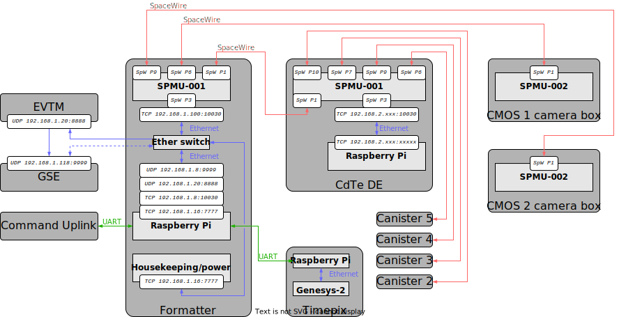

# foxsi-4matter
Code for the FOXSI-4 formatter.

This formatter replaces older FOXSI formatters with a [Raspberry Pi](https://www.raspberrypi.org) processor unit. A peripheral SPMU-001 board (based on the Xilinx Spartan 7) for [SpaceWire](https://www.star-dundee.com/wp-content/star_uploads/general/SpaceWire-Users-Guide.pdf) communication support.

## Setting up
See [PISETUP.md](PISETUP.md) for instructions on booting and configuring the Raspberry Pi.

### Dependencies
- [Boost](https://www.boost.org/)
    - boost::asio
    - boost::bind
    - boost::statechart
    - boost::interprocess
- [pigpio](https://abyz.me.uk/rpi/pigpio/download.html)
- [nlohmann JSON](https://github.com/nlohmann/json)

### Examples
You can find a few examples in the [examples folder](examples).

## More detail
The physical system is laid out like this:



## Operating

First, command the power board to turn on/off the desired systems. Then start software on detector readout systems.

### Starting DE software
As of Nov 28 2023, the DE software needs to be started manually. SSH to the DE:
```bash
ssh de
```
(on the GSE computer) then navigate to the DE main software:
```bash
cd CdTe_DE/production/run/
```
and run the DE software:
```bash
./main_CdTeDE configuration_spmu001.xml
```

For detail, go to the [DE github repository](https://github.com/foxsi/CdTe_DE).

The DE will store raw data for each connected detector in `~/CdTe_DE/production/run/data/`. Note that the DE timestamp is disconnected from any all clock time.

### DE detector mapping
The DE identifies connected canisters (in the raw data recordings) on the SpaceWire port they are connected to. For the flight configuration, this is the DE nomenclature for each detector:

| System     | Detector  | DE number | Byte   |
|------------|-----------|-----------|--------|
| canister 2 | no2021_02 | `det4`    | `0x06` |
| canister 3 | no2022_03 | `det2`    | `0x05` |
| canister 4 | no2021_05 | `det3`    | `0x04` |
| canister 5 | no2022_01 | `det1`    | `0x03` |
| de         | ---       | ---       | `0x00` |
| cmos 1     | cmos 1    | ---       | `0x07` |
| cmos 2     | cmos 2    | ---       | `0x08` |

### Starting the Formatter software
As of Nov 208 2023, the Formatter software also needs to be started manually. Do this:
```bash
ssh formatter
```
and then this:
```bash
./bin/formatter --verbose --config foxsi4-commands/systems.json
```
to run the Formatter software. Start the DE first.

When the Formatter runs, it will locally record log files to `~/foxsi-4matter/log/`.

To record the Formatter raw output on the GSE computer, navigate to `~/Documents/FOXSI/foxsi-4matter/` and run the logging application:
```bash
cd ~/Documents/FOXSI/foxsi-4matter/
python3 util/logudpy.py
```

This will save raw data to `~/foxsi-4matter/log/gse/` under a filename describing the source system for the data (for example, `cmos1_ql.log` is the raw quicklook data output of `cmos1`). **Note that these log files are overwritten on each successive run.**